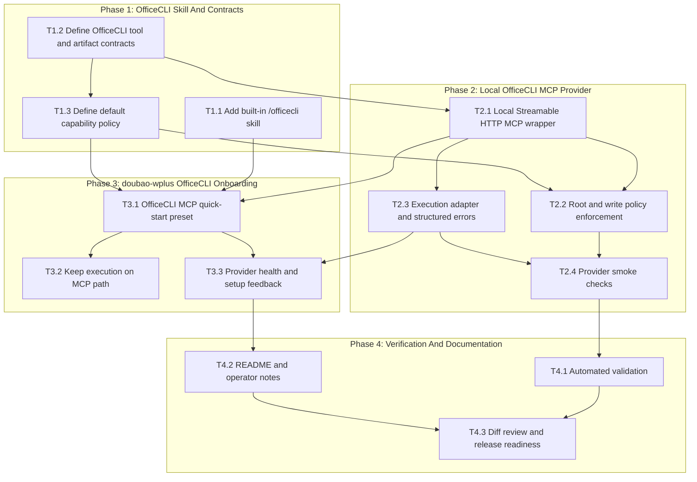

# Task Dependency Graph

```mermaid
graph TD
  subgraph P1["Phase 1: OfficeCLI Skill And Contracts"]
    T1_1["T1.1 Add built-in /officecli skill"]
    T1_2["T1.2 Define OfficeCLI tool and artifact contracts"]
    T1_3["T1.3 Define default capability policy"]
    T1_2 --> T1_3
  end

  subgraph P2["Phase 2: Local OfficeCLI MCP Provider"]
    T2_1["T2.1 Local Streamable HTTP MCP wrapper"]
    T2_2["T2.2 Root and write policy enforcement"]
    T2_3["T2.3 Execution adapter and structured errors"]
    T2_4["T2.4 Provider smoke checks"]
    T2_1 --> T2_2
    T2_1 --> T2_3
    T2_2 --> T2_4
    T2_3 --> T2_4
  end

  subgraph P3["Phase 3: doubao-wplus OfficeCLI Onboarding"]
    T3_1["T3.1 OfficeCLI MCP quick-start preset"]
    T3_2["T3.2 Keep execution on MCP path"]
    T3_3["T3.3 Provider health and setup feedback"]
    T3_1 --> T3_2
    T3_1 --> T3_3
  end

  subgraph P4["Phase 4: Verification And Documentation"]
    T4_1["T4.1 Automated validation"]
    T4_2["T4.2 README and operator notes"]
    T4_3["T4.3 Diff review and release readiness"]
    T4_1 --> T4_3
    T4_2 --> T4_3
  end

  T1_1 --> T3_1
  T1_2 --> T2_1
  T1_3 --> T2_2
  T1_3 --> T3_1
  T2_1 --> T3_1
  T2_3 --> T3_3
  T2_4 --> T4_1
  T3_3 --> T4_2
```
